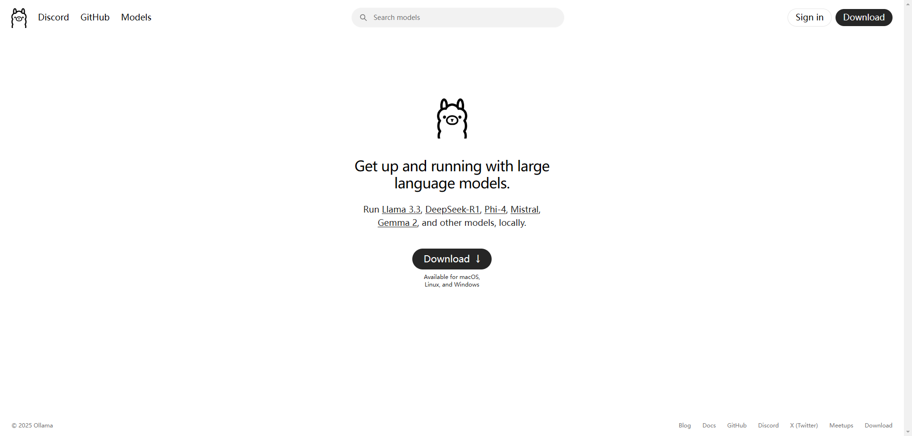
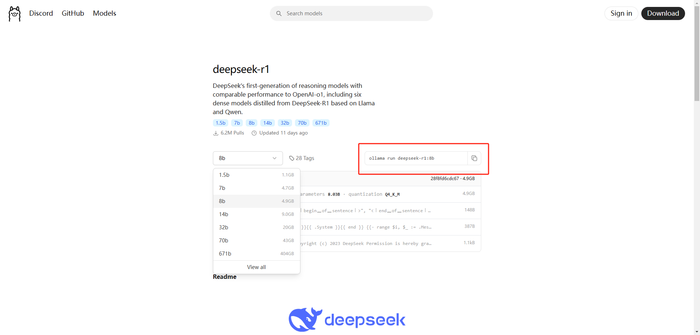
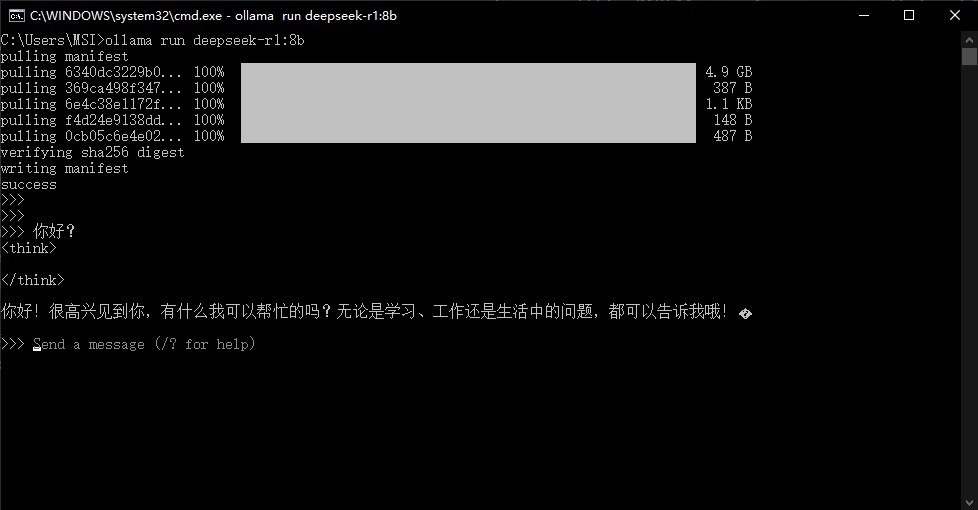
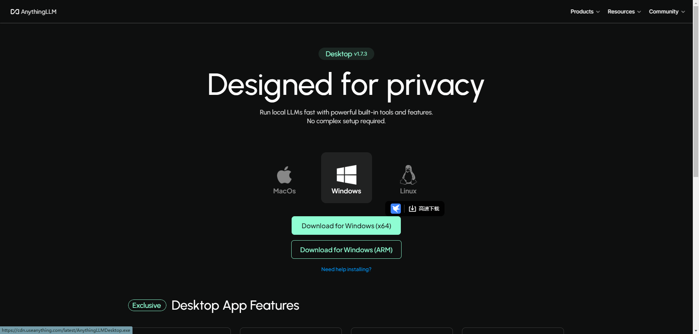
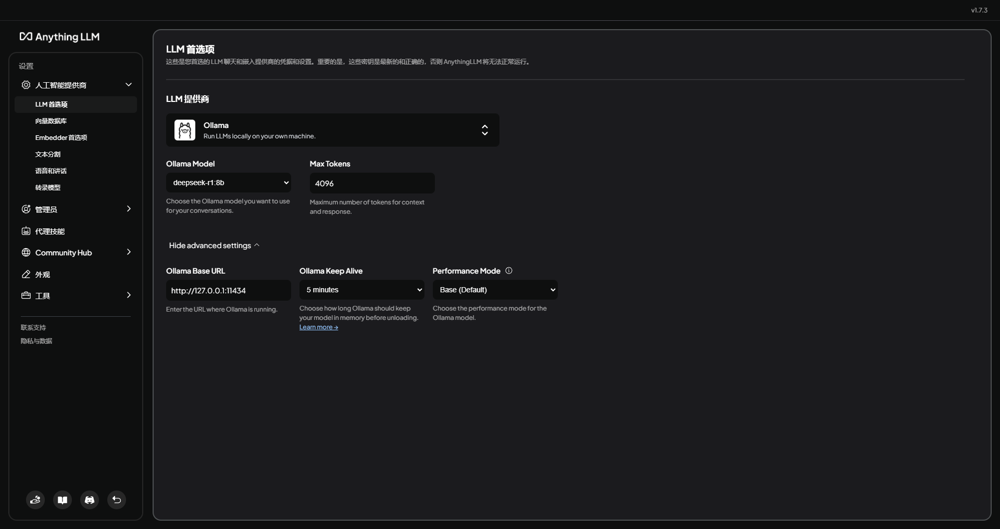

# 部署本地私有LLM模型服务

## 部署流程
- 使用`Ollama`在系统本地部署和运行LLM服务
- 使用`AnythingLLM`应用可视化运行和管理本地的LLM服务

## 部署Ollama

#### 1. 登录Ollama官网，点击download下载


安装完成后在终端运行以下命令验证安装是否成功
```cmd
~ ollama --version
ollama version is 0.5.7
```

#### 2. 在Ollama官网上搜索模型`deepseek-r1`，选择对应的模型版本（不同版本所需硬盘空间有差异），复制对应Ollama下载命令在终端运行即开始下载


:::warning
Ollama默认下载路径在系统盘`C:\Users\{userName}\AppData\Roaming\anythingllm-desktop\blob_storage`下，但是系统盘通常空间都不足（🤡），所以在运行模型下载命令前，需要更换Ollama的默认路径
:::

修改环境变量
- `此电脑右键属性 --> 高级系统设置 --> 高级 --> 环境变量`路径打开配置
- 查看系统变量（<b>是系统变量，非用户变量</b>）是否包含`OLLAMA_MODELS`变量名项，无则新建一个环境变量
- 编辑`OLLAMA_MODELS`变量，变量值为`D:\{custom_models_path}`(即新的安装路径)
- 重启Ollama服务或重启电脑生效

#### 3. 等待下载完成后，命令窗口即开启对应服务，可通过终端发送信息进行对话
:::tip
Ollama开启的模型服务的本地端口通常为`http://localhost:11434`
:::


## 部署AnythingLLM

#### 1. 可以使用Docker，也可以使用本地客户端安装包一键安装
:::tip
使用Docker部署支持多用户使用，但是Docker会默认下载到系统盘（🤡<b>后面换下设备或者看看有没有非系统盘的Docker部署方式</b>）
，两种部署方式差异：[Docker vs Desktop Version](https://docs.anythingllm.com/installation-desktop/overview)
:::

先安装desktop version，进入官网后选择windows版本下载


#### 2. 配置LLM首选项
模型服务选择`Ollama`, 模型选择下载的`deepseek-r1:8b`版本，API URL为本地服务端口`http://127.0.0.1:11434`，配置完成后开启对话窗口

