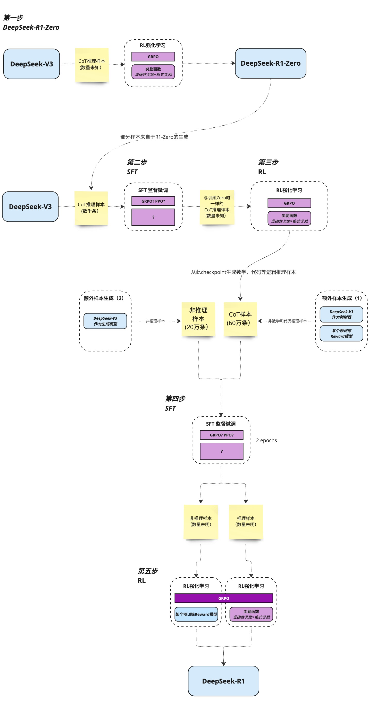

# deepseek-R1技术报告解析

## 指令模型 vs 推理模型

| 维度 | 指令模型 | 推理模型 |
| ----- | ------ | ---- |
| 训练数据 | 大量问题对（输入->答案） | 强化学习机制，优化中间步骤（输入->思考->答案） |
| 奖励机制 | 答案准确性（结果导向） | 推理路径合理性（过程+结果导向） |
| 输出控制 | 直接生成最终答案 | 强制分布输出（`<think>`标签标识思考，`<answer>`标签标识输出） |
| 应用场景 | 简单代码片段生成 | 复杂场景（模块设计、性能权衡、边界处理），问题排查、定位 |

## 强化学习机制（RL）
- [`deepseek-R1-zero`]以deepseek-v3作为基座模型，首次大规模RL（大规模的标注数据，使用GRPO模型）训练长思维链模型，没有使用SFT
- 采用rule-based奖励系统，包含两部分：
  - 准确度奖励
  - 格式奖励 
- 问题：deepseek-R1-zero很多时候的输出顺序比较乱、语言参杂，可读性较差
  
## 冷启动数据 + 多阶段训练
- 过程：
  - 1. 搜集了一小部分长的数据集去微调基座模型（冷启动SFT）
  - 2. 准备数据集，推理数据集（600K）+非推理数据集（200K）

## 蒸馏技术
大体量模型生成详细推理步骤，小模型模仿学习这些推理过程，最终达到近似大模型的计算过程。
优势：
1. 模型体积小、对于硬件配置要求降低，能力相近
2. 便于跨端的部署
3. 相较直接训练小模型的好处：数据质量高（大模型的生成结果含普通数据难以标注的推理和优化步骤思路）、可以复用大模型的全局视角、便于快速迭代

## 整体训练流程

## 当前限制

#### 数据时效性
目前R1的知识库截止时间是`2023年12月`，在此之后的事件无数据训练，相关时间维度的信息准确度降低，需通过`联网搜索`或者`RAG`方式弥补时效性。

#### 输入输出的长度限制
- R1目前提供的最大上下文token为64K（中文字符3~4w？）（无法一次投喂过长内容）
- 输出长度限制（4K/8K，单次回复中文字符2k~4k?）

#### 对于软件工程来说，R1较V3提升不多
数据验证复杂，准备的数据集量不足

## 对前端的变革
- 自动化代码审查，UI自动化测试
- 基于产品文档的低代码生成
- 分析页面性能瓶颈，给优化建议
- webAssembly的蒸馏模型部署（WebAssembly + TensorFlow.js？）
- 浏览器内智能助手：将蒸馏后的小模型嵌入Web应用，实现本地化代码提示（如Copilot Lite）
- 移动端调试工具：在手机端部署模型，实时分析性能瓶颈并给出建议